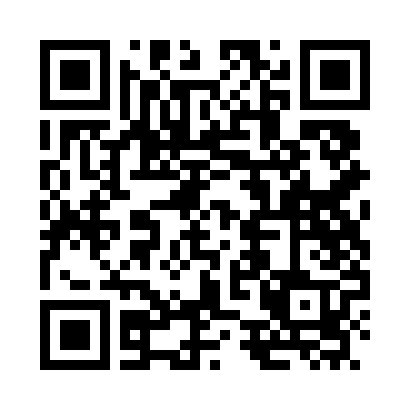

# CSBarcode - A pure C# barcode generation library

**CSBarcode** is a lightweight, pure C# library for generating barcodes, with current support for QR code generation.

It provides an **easy-to-use API** for creating high-quality QR code images, including support for generating **specialist payloads** and **Japanese Kanji** characters.

## Installation

You can add **CSBarcode** to your project by installing the **NuGet package**:

```shell
dotnet add package CSBarcode
```

## Usage

You can easily generate a QR code and save it as an image:

```csharp
using CSBarcode;

QRCode qr = QRGenerator.Generate("Message to encode", errorCorrectionLevel: ErrorCorrectionLevel.Medium);
qr.Save("/path/to/folder/qr.png", pixelsPerModule: 10);
```

### Payload Generators

**CSBarcode** provides helpful utility methods to create special QR code messages for various use cases:

#### Generate a WiFi message

```csharp
string wifiMessage = QRGenerator.GenerateWiFiMessage(
    SSID: "SSID", 
    password: "password", 
    encryption: WiFiEncryption.WPA, 
    isHiddenNetwork: false
);
```

#### Generate an Email message
```csharp
string emailMessage = QRGenerator.GenerateEmailMessage(
    email: "email@gmail.com", 
    subject: "Email subject", 
    body: "Email body"
);
```


#### Generate an SMS message
```csharp
string smsMessage = QRGenerator.GenerateSMSMessage(
    phoneNumber: "Phone number", 
    message: "SMS message"
);
```

#### Generate a Calendar Event message
```csharp
string eventMessage = QRGenerator.GenerateCalendarEventMessage(
    title: "Event title", 
    description: "Event description", 
    location: "Event location", 
    startDateTime: new DateTime(2024, 12, 25), 
    endDateTime: new DateTime(2025, 12, 25)
);
```

## Example

Example code to generate a link to a **YouTube** video:

```csharp
QRCode qr = QRGenerator.Generate("https://www.youtube.com/watch?v=dQw4w9WgXcQ", errorCorrectionLevel: ErrorCorrectionLevel.Medium);
qr.Save("./example-qr.png", pixelsPerModule: 10);
```

#### Output

